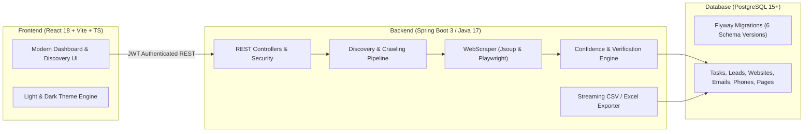

# Lead Discovery Platform

An automated, full-stack business lead discovery and contact extraction system. The platform allows users to search for businesses by location, category, and geographical radius, automatically discovers official websites, crawls internal pages (Home, About, Contact, Team), extracts verified contact details (emails, phone numbers, WhatsApp, addresses, social profiles), calculates confidence scores, and exports clean structured spreadsheets in CSV or Excel format.

---

## Architecture Overview



---

## Key Features

- **Multi-Source Business Discovery**: Finds business entities and official domains using OpenStreetMap Nominatim, DuckDuckGo, and search aggregation with intelligent directory filtering.
- **Deep Multi-Page Crawling**: Scans Home, Contact, About, and Team pages per discovered business with BFS depth tracking, domain rate limiting, and robots.txt compliance.
- **Rich Contact Extraction**: Extracts email addresses (`mailto:`, body regex), phone numbers, WhatsApp numbers (`wa.me`, `api.whatsapp.com`), physical addresses, postal codes, and social links (LinkedIn, Twitter, Facebook, Instagram, YouTube, GitHub).
- **Targeted Field Prioritization**: User-selected required fields dynamically prioritize crawl order and target page discovery.
- **Verification & Confidence Scoring**: Calculates transparent 0–100% confidence scores based on domain matching, email validity, phone structure, address presence, and contact availability.
- **Complete Source Provenance**: Tracks exact source URLs, HTTP status codes, page types, and extraction timestamps for every data point.
- **High-Performance Exporting**: Streamed, formula-injection-safe CSV and Apache POI Excel (`.xlsx`) downloads by category or full dataset.
- **Modern Responsive UI**: Clean two-column authentication, dynamic statistics, live background progress polling, error inspection drawers, and built-in Light/Dark themes.

---

## Tech Stack

### Backend
- **Framework**: Spring Boot 3.4+ / Java 17
- **Database Access**: Spring Data JPA / Hibernate 7
- **Database Migrations**: Flyway
- **Web Crawling**: Jsoup 1.18+ & Microsoft Playwright (dynamic JS rendering fallback)
- **Security**: Spring Security 6 with JWT (JSON Web Tokens) & BCrypt password hashing
- **Exports**: OpenCSV & Apache POI (`.xlsx`)
- **Testing**: JUnit 5, Mockito, Spring Boot Test

### Frontend
- **Framework**: React 18 with TypeScript
- **Build Tool**: Vite 6+
- **Styling**: Vanilla CSS Design Tokens (zero heavy CSS framework overhead, full Light & Dark mode support)
- **Icons**: Lucide React
- **State & Theme**: React Context with `localStorage` persistence

### Database
- **Engine**: PostgreSQL 15+ (tested with PostgreSQL 16/18)

---

## Getting Started

### Prerequisites
- **Java**: JDK 17 or higher
- **Node.js**: Node 18+ and npm 9+
- **Database**: PostgreSQL server running locally or accessible via network
- **Maven**: Maven 3.8+ (or use the included `mvnw` wrapper)

---

### 1. Database Setup

Create a PostgreSQL database for the application:

```sql
CREATE DATABASE lead_discovery;
```

---

### 2. Backend Configuration & Setup

1. Navigate to the `backend/` directory:
   ```bash
   cd backend
   ```

2. Copy `.env.example` to your environment or configure `application.properties`:
   ```properties
   spring.datasource.url=jdbc:postgresql://localhost:5432/lead_discovery
   spring.datasource.username=postgres
   spring.datasource.password=your_postgres_password
   server.port=8080
   app.jwt.secret=your_secure_256_bit_jwt_secret_key_here
   ```

3. Build and test the backend:
   ```bash
   mvn clean test
   ```

4. Run the Spring Boot server:
   ```bash
   mvn spring-boot:run
   ```
   The backend will start at `http://localhost:8080`. Flyway will automatically run all database migrations on startup.

---

### 3. Frontend Configuration & Setup

1. Navigate to the `frontend/` directory:
   ```bash
   cd frontend
   ```

2. Install dependencies:
   ```bash
   npm install
   ```

3. Start the development server:
   ```bash
   npm run dev
   ```
   The frontend will open at `http://localhost:5173`. Requests to `/api` are automatically proxied to `http://localhost:8080`.

4. Build for production:
   ```bash
   npm run build
   ```

---

## Environment Variables

| Variable | Default Value | Description |
|---|---|---|
| `DB_URL` | `jdbc:postgresql://localhost:5432/lead_discovery` | JDBC database connection URL |
| `DB_USERNAME` | `postgres` | Database username |
| `DB_PASSWORD` | `postgres` | Database password |
| `PORT` | `8080` | Backend server port |
| `CORS_ALLOWED_ORIGINS` | `http://localhost:5173,http://localhost:5174` | Allowed CORS origins for API requests |
| `JWT_SECRET` | *Pre-configured secret* | 256-bit secret key for signing JWT tokens |
| `JWT_EXPIRATION_MS` | `86400000` (24h) | Token validity duration in milliseconds |
| `VITE_API_URL` | *(empty / proxy)* | Frontend base URL for backend API in production |

---

## REST API Overview

### Authentication
- `POST /api/auth/register` — Register a new account
- `POST /api/auth/login` — Login and receive JWT access token
- `GET /api/auth/me` — Get current authenticated user profile

### Discovery & Tasks
- `POST /api/tasks` — Create a new lead discovery task
- `GET /api/tasks` — Paginated list of tasks
- `GET /api/tasks/{id}` — Get single task details
- `POST /api/tasks/{id}/start` — Start asynchronous execution of a task
- `POST /api/tasks/{id}/cancel` — Cancel an in-progress task
- `GET /api/tasks/{id}/progress` — Real-time progress percentage, stage, and counters
- `GET /api/tasks/{id}/errors` — Retrieve logged warnings and crawl errors

### Leads Management
- `GET /api/leads` — Search, filter by city/category/verification, sort, and paginate leads
- `GET /api/leads/{id}` — Get full lead profile with contact lists, social links, and source pages
- `DELETE /api/leads/{id}` — Delete a lead
- `GET /api/leads/categories` — Get category statistics and lead counts

### Export
- `GET /api/export/csv` — Stream CSV spreadsheet download with injection protection
- `GET /api/export/excel` — Download formatted Excel (`.xlsx`) workbook

---

## Production Deployment (Railway)

The backend is containerized with Docker and optimized for [Railway](https://railway.app) deployment.

### Prerequisites
- [Railway](https://railway.app) account (free tier available)
- GitHub repository connected to Railway

### Architecture
```
┌──────────────────┐     ┌──────────────────┐     ┌──────────────────┐
│   Frontend       │     │   Backend        │     │   PostgreSQL     │
│   (Vercel/       │────▶│   (Railway)      │────▶│   (Railway       │
│    Netlify)       │     │   Spring Boot    │     │    Addon)        │
│                  │     │   + Playwright   │     │                  │
└──────────────────┘     └──────────────────┘     └──────────────────┘
```

### Deploy to Railway

1. **Create a Railway project** and add a **PostgreSQL** database addon.

2. **Add the backend service** → Connect your GitHub repo → Set root directory to `backend/`.

3. **Set environment variables** in Railway dashboard:

| Variable | Value | Required |
|---|---|---|
| `DB_URL` | `jdbc:postgresql://<PGHOST>:<PGPORT>/<PGDATABASE>` | ✅ |
| `DB_USERNAME` | From Railway PostgreSQL addon | ✅ |
| `DB_PASSWORD` | From Railway PostgreSQL addon | ✅ |
| `JWT_SECRET` | Generate: `openssl rand -hex 32` | ✅ |
| `JWT_EXPIRATION_MS` | `86400000` (24 hours) | ✅ |
| `CORS_ALLOWED_ORIGINS` | `https://your-frontend-domain.vercel.app` | ✅ |
| `SPRING_PROFILES_ACTIVE` | `production` | ✅ |
| `PORT` | Auto-set by Railway | Auto |
| `DB_POOL_MAX` | `10` (default) | Optional |
| `DB_POOL_MIN` | `2` (default) | Optional |

4. **Deploy** — Railway auto-builds using the `Dockerfile` and starts the service.

5. **Verify** — Hit `https://your-backend.railway.app/api/health`:
   ```json
   {"status": "UP", "timestamp": "...", "service": "lead-discovery-backend"}
   ```

### Docker Image Details

- **Build stage**: `maven:3.9-eclipse-temurin-17` — compiles the fat JAR
- **Runtime stage**: `mcr.microsoft.com/playwright/java:v1.49.0-noble` — includes JDK 17 + Chromium browser + all system dependencies
- **No Node.js/npm needed** — Playwright browsers are pre-installed in the official image
- **Non-root user** — runs as `appuser` for security
- **Health check** — built-in Docker HEALTHCHECK on `/api/health`

### Local Docker Testing

```bash
cd backend

# Build the image
docker build -t lead-discovery-backend .

# Run with local PostgreSQL
docker run -p 8080:8080 \
  -e PORT=8080 \
  -e DB_URL=jdbc:postgresql://host.docker.internal:5432/lead_discovery \
  -e DB_USERNAME=postgres \
  -e DB_PASSWORD=your_password \
  -e JWT_SECRET=your_jwt_secret_minimum_256_bits_hex \
  -e CORS_ALLOWED_ORIGINS=http://localhost:5173 \
  lead-discovery-backend

# Verify
curl http://localhost:8080/api/health
```

### Frontend Deployment

Build the static bundle and deploy to Vercel, Netlify, or Cloudflare Pages:
```bash
cd frontend
VITE_API_URL=https://your-backend.railway.app npm run build
```

Set `VITE_API_URL` to your Railway backend URL.

---

## License
MIT License.

